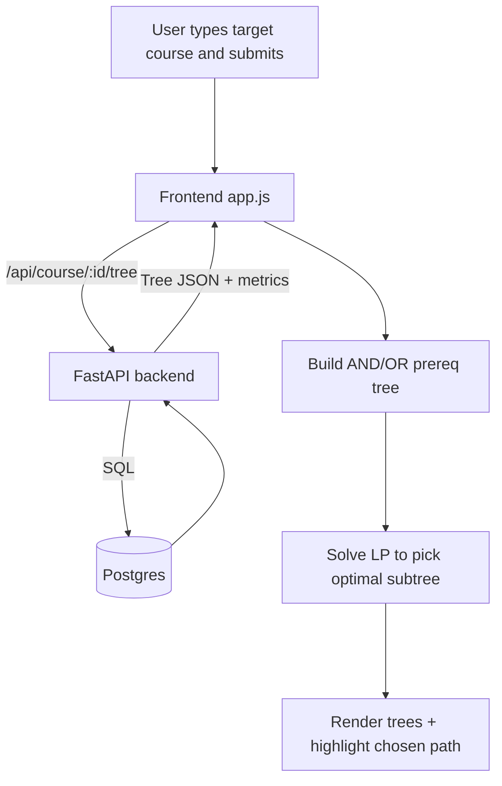
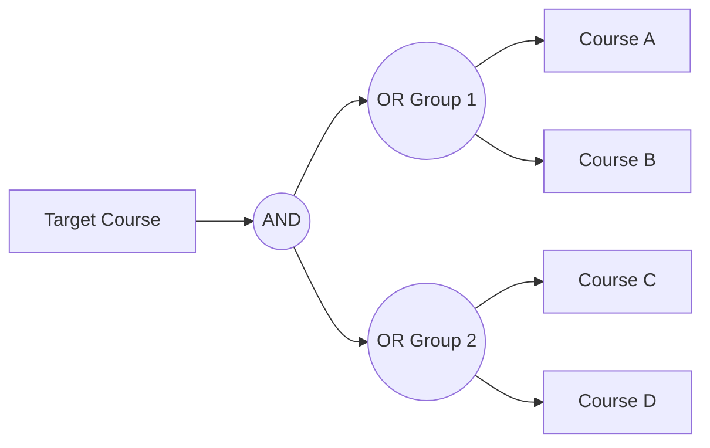

# UW Course Explorer

Interactive UW Prereq Explorer: visualize UW course prerequisite and future-course trees, with search and ratings-weighted path recommendations. This tool helps University of Waterloo students plan their academic path by providing a clear, visual representation of complex course dependencies and suggesting optimal prerequisite pathways based on their personal preferences.

## End-to-End User Flow (UI → API → DB → LP Solver → UI)

## Core Problem: Optimal Course Path Selection

For any given target course, its prerequisites can form a complex tree of requirements with AND/OR logic. The primary technical challenge is to navigate this structure to find an "optimal" path for a student. This project frames the challenge as an **optimal directed subtree selection problem**. The goal is to select a subtree, rooted at the target course, that satisfies all logical requirements while maximizing a total "weight" score derived from user preferences and historical course data.

### Methodology: Graph Model + Linear Programming

We model the structure as a rooted **Directed Acyclic Graph (DAG)** with course nodes and junction nodes (AND/OR). The optimal prerequisite set is chosen by solving a small mixed-integer linear program (MILP).

-   At **AND-nodes**, selecting a parent implies all children must be selected.
-   At **OR-nodes**, selecting a parent implies at least one child must be selected.

This yields a compact MILP that modern solvers can solve very quickly for the problem sizes here.

#### LP/MILP Formulation

Let $V_c$ be course nodes and $V_j$ be junction nodes (AND/OR). Define binary decision variables for all nodes $x_v \in \{0,1\}$ indicating whether node $v$ is chosen in the prerequisite subtree. The target course $r$ is forced to be selected: $x_r = 1$.

Objective (minimize total cost of selected courses):

$$\min \sum_{v \in V_c} c_v\, x_v$$

where $c_v = 1 - w_v/100 + p_v$ combines preference-based weight $w_v$ and an optional depth-aware penalty $p_v$ to encourage course reuse.

Constraints encode AND/OR logic:

- AND node $u$ with children $C(u)$: for all $v \in C(u)$, $x_v \ge x_u$. If an AND is selected, all children must be selected.
- OR node $u$ with children $C(u)$: $\sum_{v \in C(u)} x_v \ge x_u$. If an OR is selected, at least one child must be selected.
- Junction-to-course propagation: if a course node has a parent junction $p$, enforce $x_{course} \ge x_p$ when that edge exists.

This MILP returns a binary selection over nodes that satisfies all logic and minimizes total cost. The frontend then highlights the selected course nodes as the recommended path.

#### AND/OR Graph Example

Selecting `R` requires selecting `A`. For the two OR groups under `A`, at least one child is chosen from each group to satisfy the AND.

### Course Path Finder: The Weighting Algorithm

To make the path "optimal," each course is assigned a weight based on historical student feedback and the user's selected preference.

**1. Input Metrics:** For each course, we use:
-   `liked` score (0-100)
-   `easy` score (0-100)
-   `useful` score (0-100)
-   Number of ratings

**2. User Preference:** The user selects a preference (e.g., "Focus on likeness," "Balanced"), which translates to a weight vector $\beta = (\beta_1, \beta_2, \beta_3)$. For example, "Focus on likeness" might use $\beta = (0.7, 0.15, 0.15)$.

**3. Reliability Scaling:** To account for rating confidence, a scaling factor $\lambda_i$ is applied. Courses with more ratings (e.g., > 100) receive a slight boost ($\lambda_i = 1.1$), while those with few ratings (e.g., < 50) are slightly penalized ($\lambda_i = 0.9$).

**4. Final Node Weight Calculation:** The final weight $y_i$ for a course is a weighted average of its scores, adjusted for reliability:

$$ y_i = \lambda_i \cdot (\beta_1 x_{\text{liked}} + \beta_2 x_{\text{easy}} + \beta_3 x_{\text{useful}}) $$

### Global Optimization: Promoting Course Reuse

A naive algorithm might select high-weight courses that lead to an inefficient path with many total courses. To solve this, the model introduces a **depth-aware new-course penalty**.

-   The "cost" of adding a course to the path is `1 - y_v/100`.
-   If a course is selected for the *first time*, an additional penalty is added. This penalty decreases with the prerequisite's depth, encouraging the reuse of courses that appear in multiple branches (like reusing MATH 138 for both a STAT and a MATH prerequisite).

The algorithm's objective is to find a valid path $P$ that minimizes the total cost, balancing course quality (high weight) with path efficiency (course reuse).
