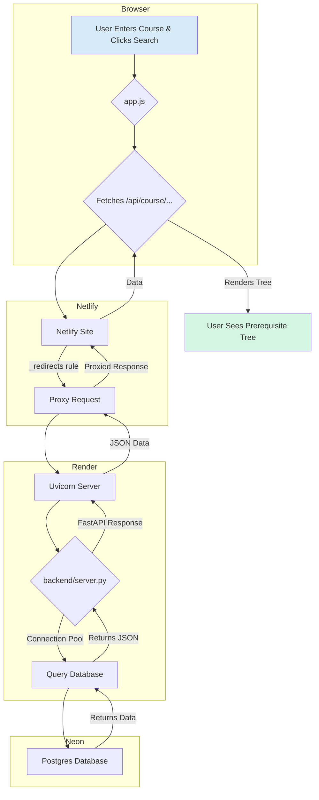

# UW Course Explorer

Interactive UW Prereq Explorer: visualize UW course prerequisite and future-course trees, with search and ratings-weighted path recommendations. This tool helps University of Waterloo students plan their academic path by providing a clear, visual representation of complex course dependencies and suggesting optimal prerequisite pathways based on their personal preferences.

## Website Logic and Architecture

The application is built with a decoupled architecture consisting of a static frontend, a dynamic backend API, and a cloud-based database.

-   **Frontend:** A vanilla JavaScript, HTML, and CSS application served statically by **Netlify**. It is responsible for all user interaction and rendering the course trees.
-   **Backend API:** A Python **FastAPI** application hosted on **Render**. It exposes endpoints to fetch course data, prerequisites, and future paths. It contains all the business logic for tree traversal and pathfinding.
-   **Database:** A **Postgres** database hosted on **Neon**. It stores all course information, prerequisite relationships, and user ratings scraped from public sources.
-   **Proxy:** A **Netlify** redirect rule acts as a proxy, forwarding requests from the user's browser for `/api/*` to the backend service on Render. This avoids CORS issues and simplifies frontend configuration.

## Core Problem: Optimal Course Path Selection

For any given target course, its prerequisites can form a complex tree of requirements with AND/OR logic. The primary technical challenge is to navigate this structure to find an "optimal" path for a student. This project frames the challenge as an **optimal directed subtree selection problem**. The goal is to select a subtree, rooted at the target course, that satisfies all logical requirements while maximizing a total "weight" score derived from user preferences and historical course data.

### Methodology: Graph Traversal and Dynamic Programming

We model the course structure as a rooted **Directed Acyclic Graph (DAG)**, where nodes are either courses or logical operators (AND/OR). The pathfinding is handled by a recursive algorithm that traverses this graph.

-   At **AND-nodes**, all children must be satisfied, so the algorithm explores all branches.
-   At **OR-nodes**, the algorithm selects the child branch that yields the best score (lowest cost), making a locally optimal decision.

This approach effectively treats the course selection challenge as a dynamic programming problem on a tree, which is a generalization of the classic AND/OR pathfinding problem in graphs.

### Course Path Finder: The Weighting Algorithm

To make the path "optimal," each course is assigned a weight based on historical student feedback and the user's selected preference.

**1. Input Metrics:** For each course, we use:
-   `liked` score (0-100)
-   `easy` score (0-100)
-   `useful` score (0-100)
-   Number of ratings

**2. User Preference:** The user selects a preference (e.g., "Focus on likeness," "Balanced"), which translates to a weight vector $\beta = (\beta_1, \beta_2, \beta_3)$. For example, "Focus on likeness" might use $\beta = (0.7, 0.15, 0.15)$.

**3. Reliability Scaling:** To account for rating confidence, a scaling factor $\lambda_i$ is applied. Courses with more ratings (e.g., > 100) receive a slight boost ($\lambda_i = 1.1$), while those with few ratings (e.g., < 50) are slightly penalized ($\lambda_i = 0.9$).

**4. Final Node Weight Calculation:** The final weight $y_i$ for a course is a weighted average of its scores, adjusted for reliability:
$$ y_i = \lambda_i \cdot (\beta_1 x_{\text{liked}} + \beta_2 x_{\text{easy}} + \beta_3 x_{\text{useful}}) $$

### Global Optimization: Promoting Course Reuse

A naive algorithm might select high-weight courses that lead to an inefficient path with many total courses. To solve this, the model introduces a **depth-aware new-course penalty**.

-   The "cost" of adding a course to the path is `1 - y_v/100`.
-   If a course is selected for the *first time*, an additional penalty is added. This penalty decreases with the prerequisite's depth, encouraging the reuse of courses that appear in multiple branches (like reusing MATH 138 for both a STAT and a MATH prerequisite).

The algorithm's objective is to find a valid path $P$ that minimizes the total cost, balancing course quality (high weight) with path efficiency (course reuse).
